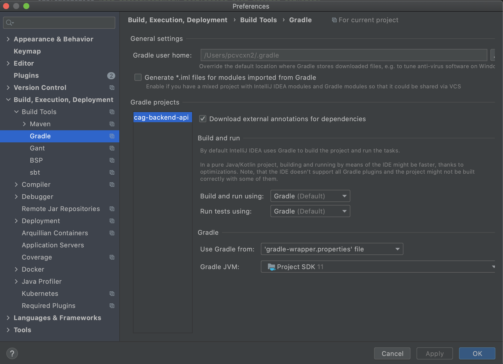
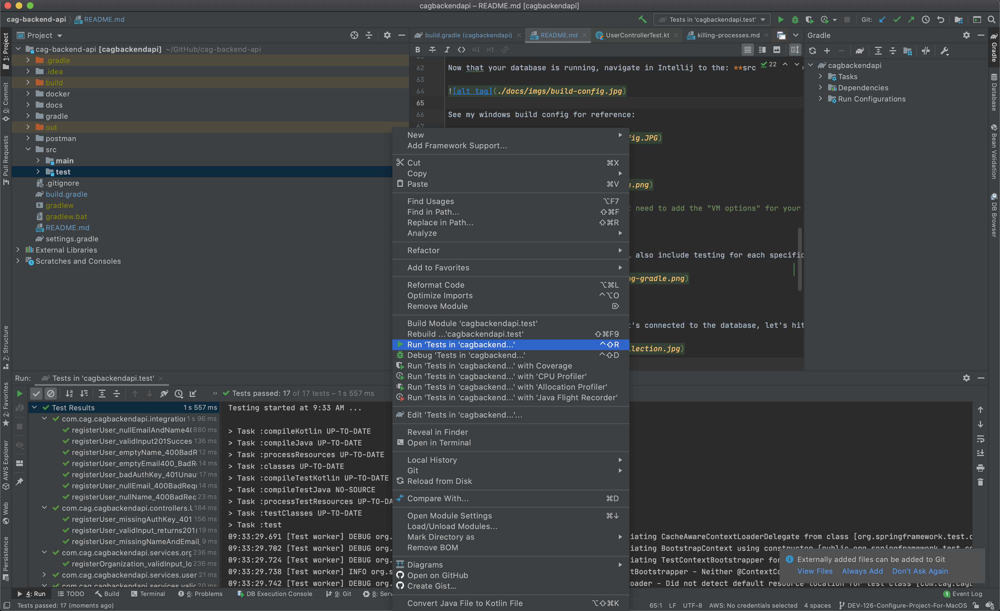

# Chicago Artist Guide Backend API Project

This backend API powers our frontend react application using tools including: Java, Kotlin, Spring Boot, Docker, Postgres. The Chicago Artist Guide web app is a place for Chicago theatre companies, individual artists, and communities to come together and facilitates the casting process for theatre organizations.

## To develop on and run this project you'll need to install these free apps:

- Intellij IDEA Community Edition: https://www.jetbrains.com/idea/download/#section=windows
- Git: https://git-scm.com/downloads

### Optional Apps That Also Help:

- Docker (If you're on MacOS, it's very hard to setup on Windows): https://docs.docker.com/get-docker/
- Postman: https://www.postman.com/downloads/

## Configuring Intellij & Installing Java JDK 11

To open the project in Intellij, open Intellij and click "Open or Import project". Navigate to the project **_and double click the build.gradle file_** to open the project.

To install Java JDK 11, Intellij has a convenient tool that makes it very easy to install. Go to **File -> Project Structure -> Project SDK -> Add SDK -> Download SDK**.

Once you are at this menu, make the Vendor **AdoptOpenJDK** and select version **11.0.9.1**. Download that, click "Apply", and you should be good! See the image below:

Now that you have your JDK 11, go to: **File -> Settings -> Build, Execution, Deployment -> Build Tools -> Gradle -> Gradle JVM** and select AdoptJdk11 as your Gradle JVM. Click "Apply" and wait for the project to reload.

## Configuring Intellij Lombok Plugin

Lombok is a tool we use with Java to make creating model classes easier, but it's a bit of a pain to setup. The first step is to go to **File -> Settings -> Plugins -> Marketplace** and then search for "Lombok". It should look like the below picture, install it and apply changes:

Now that you have the plugin we need to apply Annotation Processing to the project in order to use the plugin. To do this, go to: **File -> Settings -> Build, Execution, Deployment -> Compiler -> Annotation Processing**. Once you are at this menu, enable Annotation Processing by checking the checkbox like this:

## Configuring Intellij DB Navigator Plugin

DB Navigator is a plugin we use to manage our database connections that works great on both windows and mac. The first step is to go to **File -> Settings -> Plugins -> Marketplace** and then search for "DB Navigator". It should look like the below picture, install it and apply changes:

## Running The Project

Navigate in Intellij to the: **src -> main -> java -> com.cag.cagbackendapi -> CagBackendApiApplication** file. Once in there, if your gradle is working properly you should see a green play button next to the left of the class. Click this play button and run the app.
 
Once the app has booted up completely, you can go to your browser and go to the url: **http://localhost:9000/**. Here you'll see all of our endoints and you can use any of the endpoints by providing the correct authKey value from the application.yml file for the Spring Profile you're running (Probably the LOCAL profile).

## Running Our Tests

Along with our features we develop, we'll also include testing for each specific use case our feature could possibly encounter. To run our tests, the first thing you'll need to do is ensure that your Intellij preferences build and run our tests from **Gradle** and not **Intellij**. Go to: **Intellij -> Preferences -> Build, Execution, Deployment -> Build Tools -> Gradle**. From there, select: **Gradle** for the "Build and run using:" and the "Run tests using:" drop-down menus. It should look like this when you're done:

You'll now be able to right-click on the "test" folder and run all of our project tests. See the image below for the correct button to click and the resulting passing tests:

## Postman

Now that you're running your project that's connected to the database, let's hit some endpoints! Open Postman. In Postman, click the black "Import" button on the top left of the Postman App next to the "+ New" button. Now navigate to the project directory and click the latest postman collection in the **postman** folder. This will import the collection into your Postman and you'll be able to run the requests in the collection against our app running on your local machine. See below image for help importing:

In our collection, you'll see a **local/** and **prod/** directory. Our local requests point to the local app running on our local machines, while the prod folder will point to our deployed application. If your app is running in Intellij and your postgres database is running in docker - you should be able to use the saveUser request in the local directory in our postman collection to save a new test user to our database. It should look like this when you run it:

