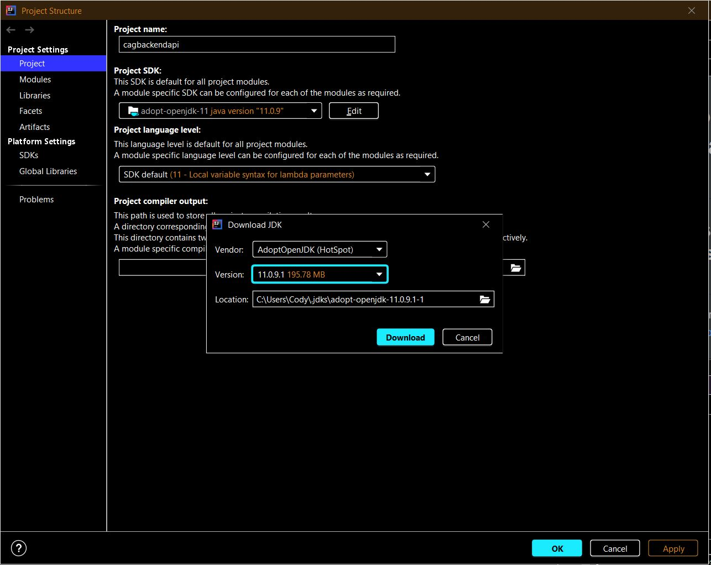
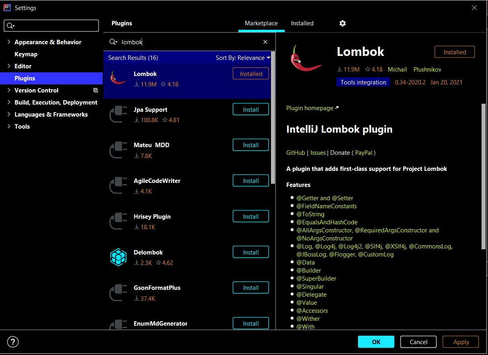
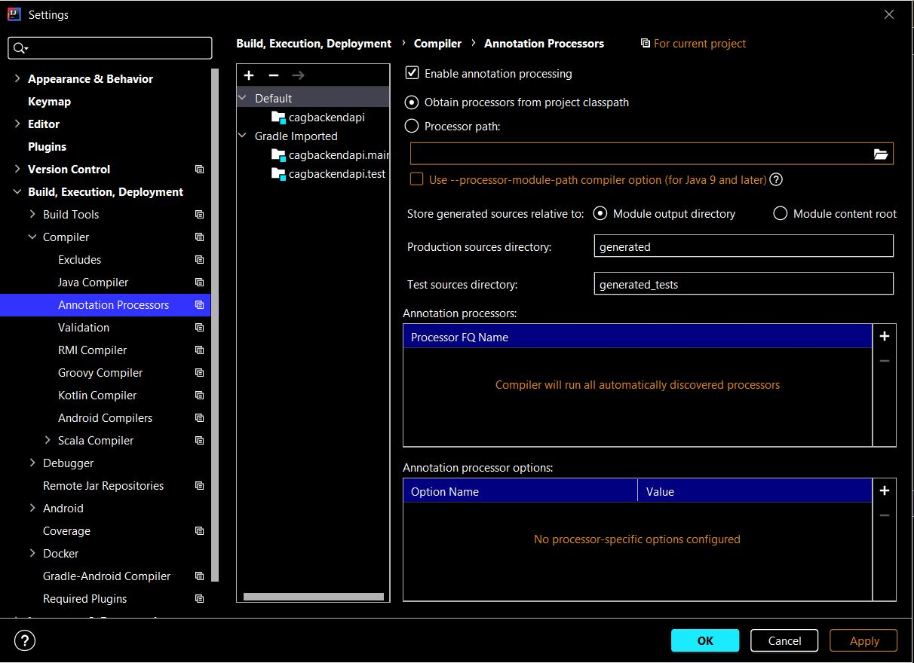
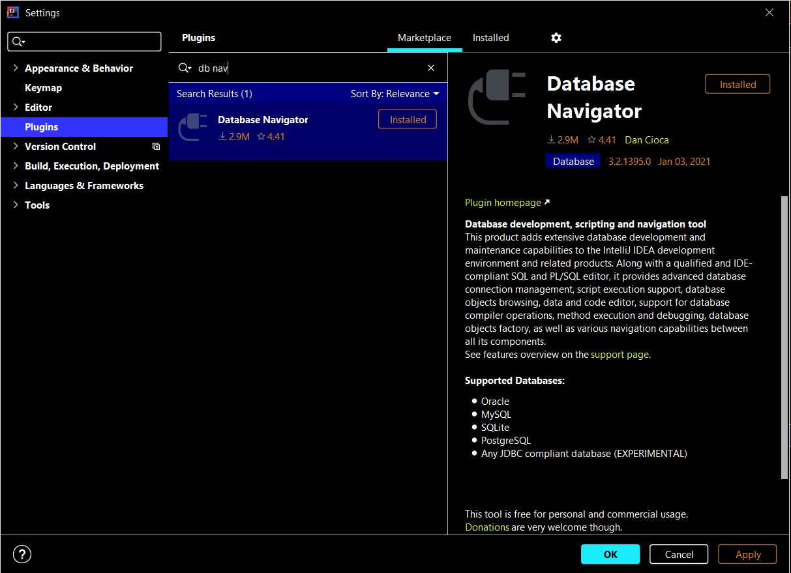
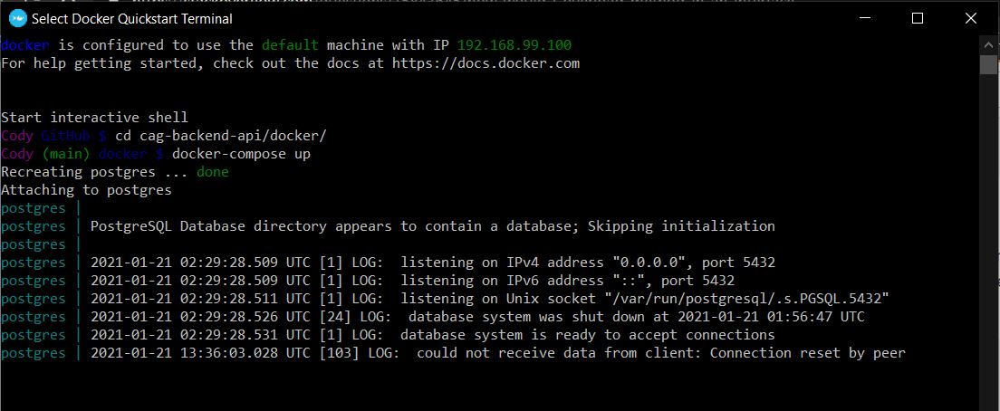
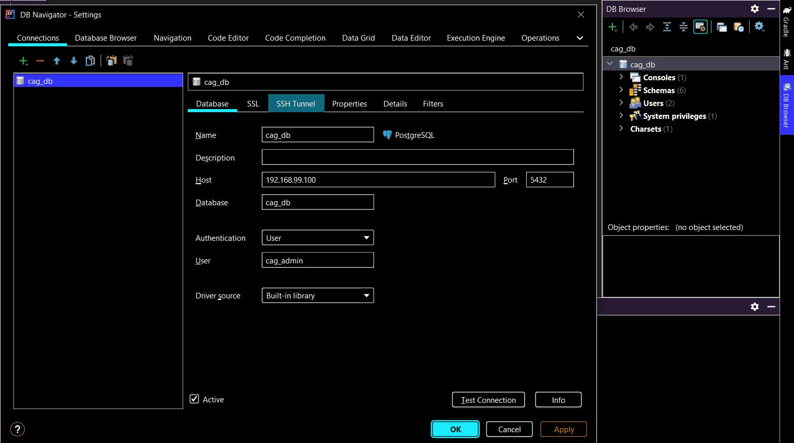
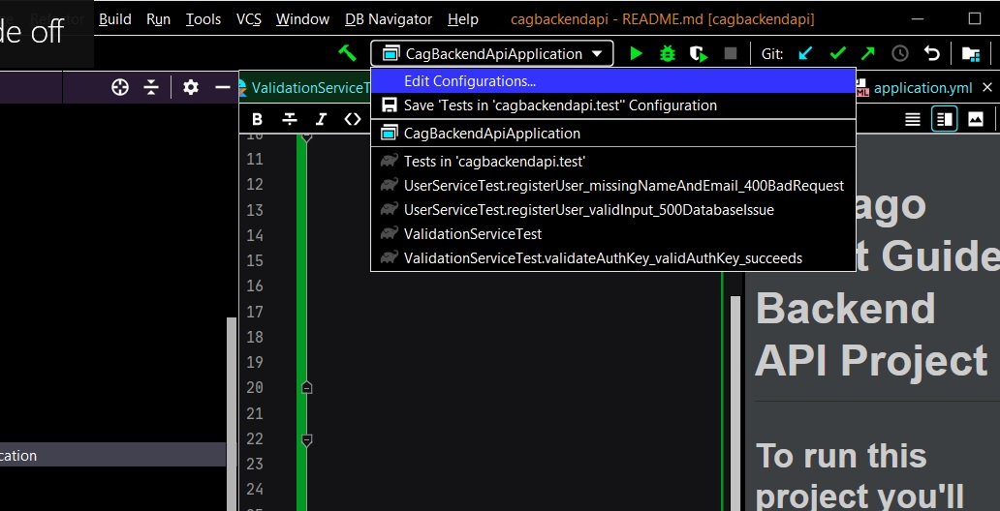
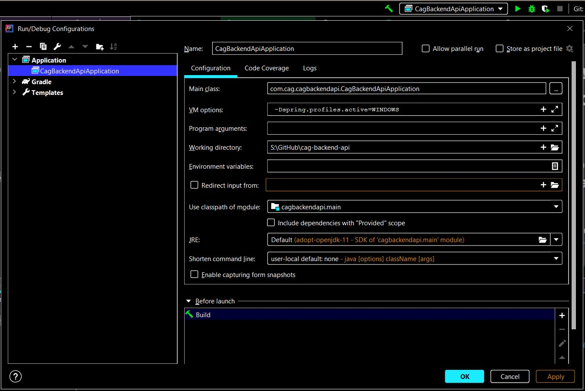
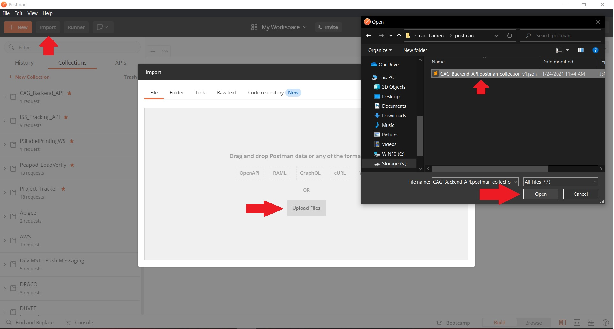

# Chicago Artist Guide Backend API Project

## To run this project you'll need to install these free apps:.

- Intellij IDEA Community Edition: https://www.jetbrains.com/idea/download/#section=windows
- Docker: https://docs.docker.com/get-docker/
- Postman: https://www.postman.com/downloads/
- Git: https://git-scm.com/downloads

## Configuring Intellij & Installing Java JDK 11

To open the project in Intellij, open Intellij and click "Open or Import project". Navigate to the project **_and double click the build.gradle file_** to open the project.

To install Java JDK 11, Intellij has a convenient tool that makes it very easy to install. Go to **File -> Project Structure -> Project SDK -> Add SDK -> Download SDK**.

Once you are at this menu, make the Vendor **AdoptOpenJDK** and select version **11.0.9.1**. Download that, click "Apply", and you should be good! See the image below:

Now that you have your JDK 11, go to: **File -> Settings -> Build, Execution, Deployment -> Build Tools -> Gradle -> Gradle JVM** and select AdoptJdk11 as your Gradle JVM. Click "Apply" and wait for the project to reload.

## Configuring Intellij Lombok Plugin

Lombok is a tool we use with Java to make creating model classes easier, but it's a bit of a pain to setup. The first step is to go to **File -> Settings -> Plugins -> Marketplace** and then search for "Lombok". It should look like the below picture, install it and apply changes:

Now that you have the plugin we need to apply Annotation Processing to the project in order to use the plugin. To do this, go to: **File -> Settings -> Build, Execution, Deployment -> Compiler -> Annotation Processing**. Once you are at this menu, enable Annotation Processing by checking the checkbox like this:

## Configuring Intellij DB Navigator Plugin

DB Navigator is a plugin we use to manage our database connections that works great on both windows and mac. The first step is to go to **File -> Settings -> Plugins -> Marketplace** and then search for "DB Navigator". It should look like the below picture, install it and apply changes:

## Configuring Your Containerized Postgres Database Using DB Navigator & Docker

The first step to running the project is to setup your database because if your database is unavailable at the time you run the project it will crash.

To do this: If you're on mac you can do to your terminal, if you're on windows go to Docker Quickstart Terminal. Then "cd" into the project and into the "docker/" directory. From there, run the command: "docker-compose up". This should download the postgres docker container and start to run your postgres database.

With the DB Navigator plugin installed, the **DB Browser** menu should appear in your intellij. Open the DB Browser menu, click the green plus sign, add a new PostgreSQL connection. On the menu that appears to add the connection, populate it with values like this:

Windows:

## Setting Up Your Build Configuration & Running The Project

Now that your database is running, navigate in Intellij to the: **src -> main -> java -> com.cag.cagbackendapi -> CagBackendApiApplication** file. Once in there, if your gradle is working properly you should see a green play button next to the left of the class. Click this play button and run the app. If you're on windows, it will crash because we need to specify the correct spring profile in the build configuration. Go to the build configuration as seen in the image below, and set the **VM options** to: **-Dspring.profiles.active=WINDOWS** in your build configuration. Click apply, and try to run again.
 

See my windows build config for reference:

## Postman

Now that you're running your project that's connected to the database, let's hit some endpoints! Open Postman. In Postman, click the black "Import" button on the top left of the Postman App next to the "+ New" button. Now navigate to the project directory and click the latest postman collection in the **postman** folder. This will import the collection into your Postman and you'll be able to run the requests in the collection against our app running on your local machine. See below image for help importing:

In our collection, you'll see a **local/** and **prod/** directory. Our local requests point to the local app running on our local machines, while the prod folder will point to our deployed application. If your app is running in Intellij and your postgres database is running in docker - you should be able to use the saveUser request in the local directory in our postman collection to save a new test user to our database. It should look like this when you run it:

