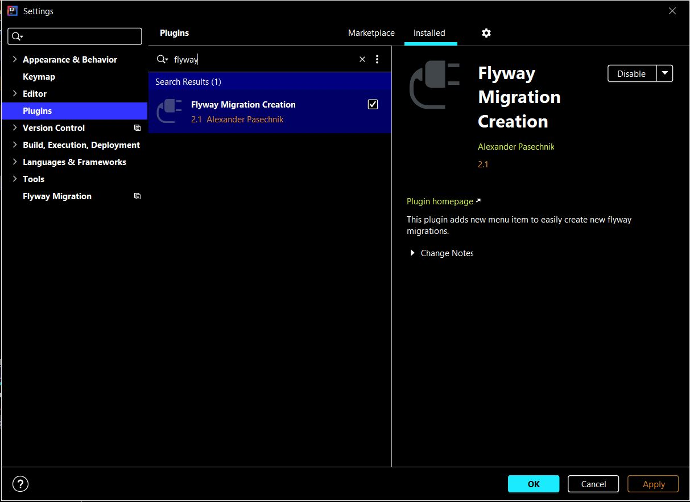
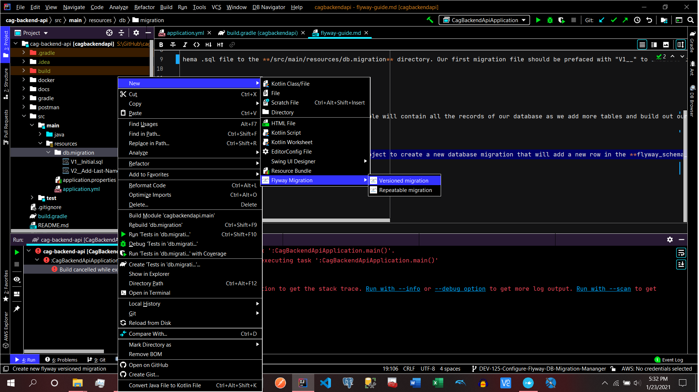
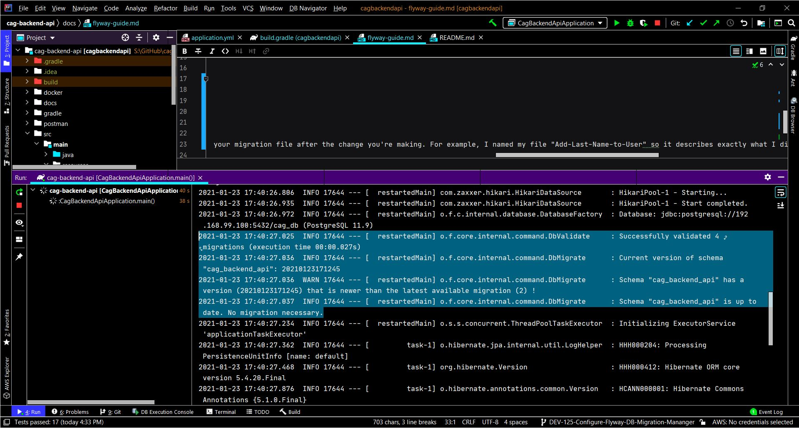

# Flyway Guide

Flyway allows you to keep the structure of your DB and your application in sync. The traditional way of applying database changes was manually applying it before your app is deployed and then deploy the app to your servers. With microservices slowly becoming a de-facto standard you would use for developing enterprise software, it makes sense to automate DB migrations as well. By DB migrations I mean, applying changes to your DB structure in line with your app. 

Flyway automates that. It makes it really easy to apply any sort of database migration.

All you need to do is create a .sql file with your DDL (or DML), basically a file with multiple sql statements separated by a ‘;’, just like you would create any sql script.

To create our initial flyway migration need to first add our schema .sql file to the **/src/main/resources/db.migration** directory. Our first migration file should be prefaced with "V1__" to indicate that it is the first database migration. All subsequent migrations can be created using the **Flyway Migration Management** Intellij Plugin that I'll show you in teh next section. To initialize our first database migration we can run this command while our database is running:

```
gradle flywayMigrate -i
```

This will create the **flyway_schema_history** table under our **public** schema in our database. This table will contain all the records of our database as we add more tables and build out our database!

## Adding New Migrations

To add new migrations we'll first install the **Flyway Migration Management** Intellij Plugin that looks like this:



Once you have that installed and you have a database change to make - you can right-click on the **db.migration** folder found in the **/src/main/resources/** folder. Then you can go to: **New -> Flyway Migration -> Versioned migration**. Name your migration file after the change you're making. For example, I named my file "Add-Last-Name-to-User" so it describes exactly what I did. See below picture for reference:



In this .sql file that is created in db.migration, you can write the SQL code to change the database. See mine for reference where I altered a table to add a column. You could also create a new table or add constraints to tables or any database update. For your update to take effect, all you have to do is run the project as you normally would and your migration will be applied like this:


