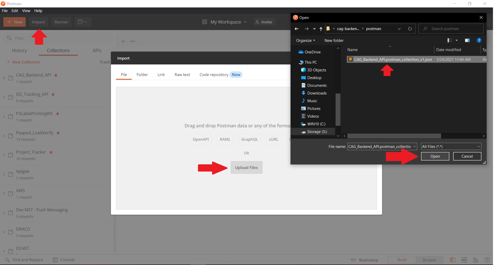

# Postman Guide

Now that you're running your project that's connected to the database, let's hit some endpoints! Open Postman. In Postman, click the black "Import" button on the top left of the Postman App next to the "+ New" button. Now navigate to the project directory and click the latest postman collection in the **postman** folder. This will import the collection into your Postman and you'll be able to run the requests in the collection against our app running on your local machine. See below image for help importing:

In our collection, you'll see a **local/** and **prod/** directory. Our local requests point to the local app running on our local machines, while the prod folder will point to our deployed application. If your app is running in Intellij and your postgres database is running in docker - you should be able to use the saveUser request in the local directory in our postman collection to save a new test user to our database. It should look like this when you run it:

