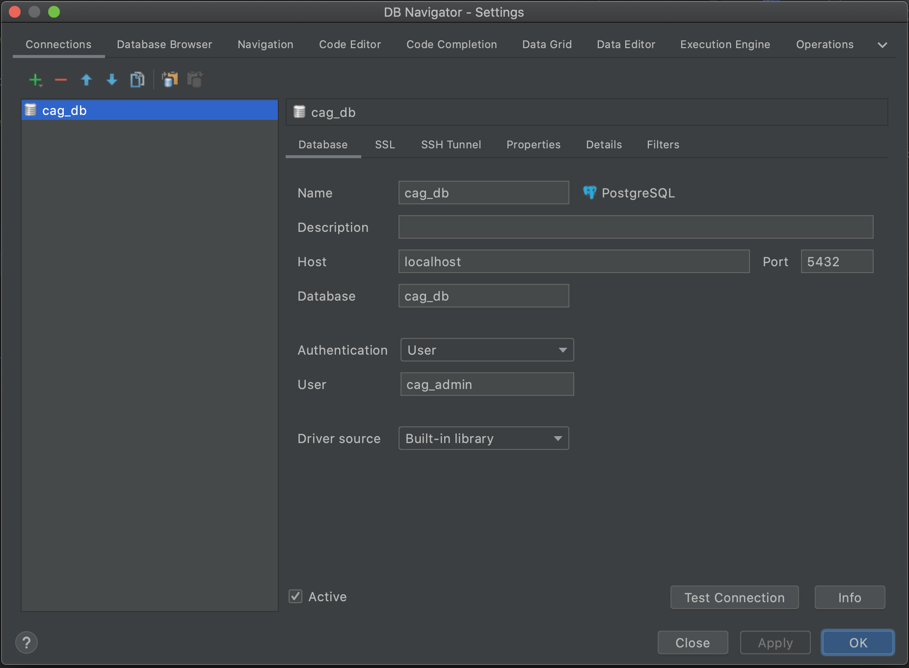
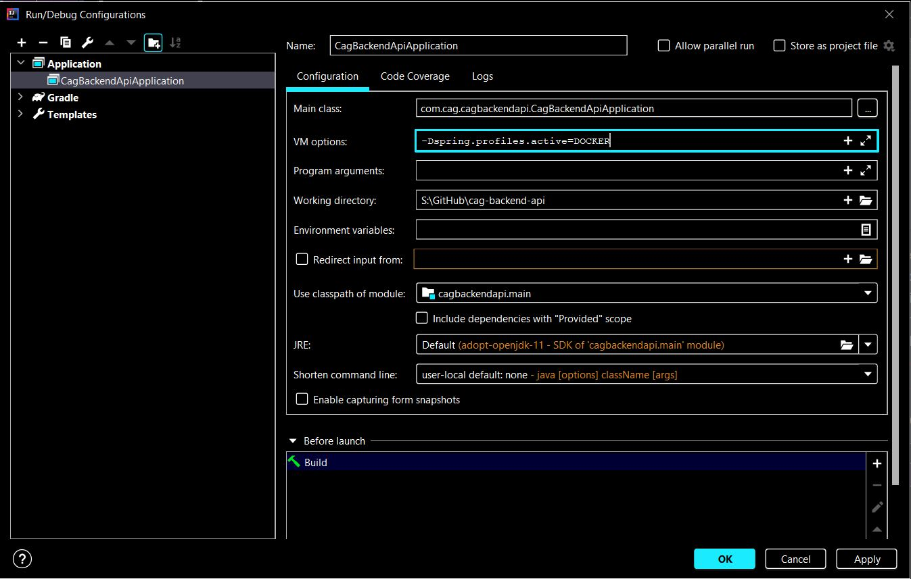

# Configuring Your Containerized Postgres Database Using DB Navigator & Docker On MacOS

The first step to running the project with docker is to setup your database because if your database is unavailable at the time you run the project it will crash.

Go to your terminal. Then "cd" into the project and into the "docker/" directory. From there, run the command: "docker-compose up". This should download the postgres docker container and start to run your postgres database.


With the DB Navigator plugin installed, the **DB Browser** menu should appear in your Intellij. Open the DB Browser menu, click the green plus sign, add a new PostgreSQL connection. On the menu that appears to add the connection, populate it with values like this:



Testing connection should connect fine to the database. Now you'll need to enable the Spring Profile for running the app using Docker. You can get to your build configuration like this:


In your build configuration for running the app locally - set the **VM options** to: **-Dspring.profiles.active=DOCKER** in your build configuration. This will tell the app when it starts to look for the Docker database instead of the Heroku one. 



You should not be able to run the app. To make the tests pass, don't forget to set the active profile in the Integration test files to **DOCKER** for all integration tests.

```java
// NOTE: Update active profile to reflect your operating system to connect to database
@SpringBootTest(webEnvironment = SpringBootTest.WebEnvironment.RANDOM_PORT)
@ActiveProfiles(value = ["DOCKER"], resolver = SpringCommandLineProfileResolver::class)
class UserControllerIntegrationTests {
```

Please see the docs/ directory for docker tips.
