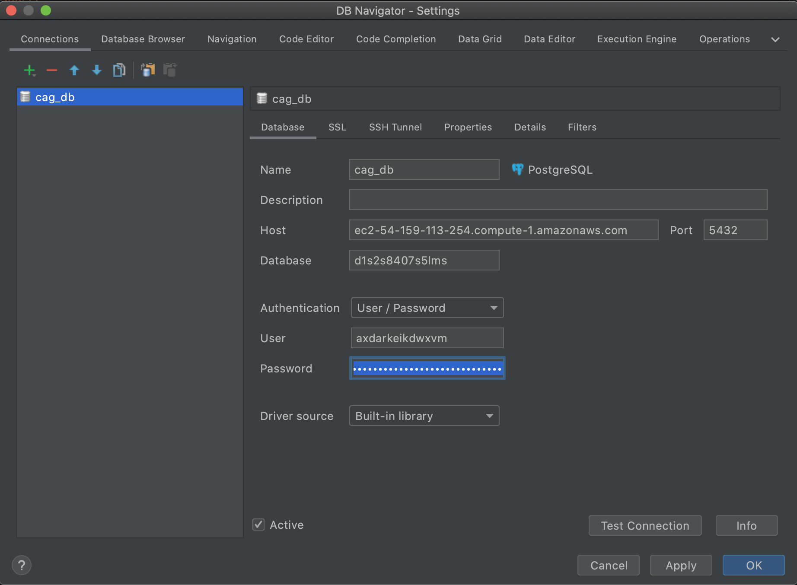

# Running The Project Using Docker Compose

Docker is an amazing tool we can use to run a Postgres testing database locally for testing and development purposes. In order to connect to a postgres database running in docker, we can use the DB Navigator Intellij Plugin because the native Intellij database navigator struggles to connect to databases running in Docker. 

## Configuring Intellij DB Navigator Plugin

DB Navigator is a plugin we use to manage our database connections that works great on both windows and mac. The first step is to go to **File -> Settings -> Plugins -> Marketplace** and then search for "DB Navigator". It should look like the below picture, install it and apply changes:

## Connecting To The QA Database

Once you have DB Navigator installed, you can click the **DB Browser** tab that will appear in your Intellij once you apply the plugin and restart Intellij. From the **DB Browser** menu, you can click the green plus sign on the top left and add a new PostgreSQL connection. You can find the database credentials for the connection in the **src/main/resources/application.yml** file in the **LOCAL** Spring Profile. Grab the host, port number, database name, user name, and user password from that file and insert the data into your new connection. Then test your connection. It should look like this when you're done:

